# Plotting functions

``` r
library(lineaGT)
#> Warning: replacing previous import 'cli::num_ansi_colors' by
#> 'crayon::num_ansi_colors' when loading 'VIBER'
#> Warning: replacing previous import 'cli::num_ansi_colors' by
#> 'crayon::num_ansi_colors' when loading 'easypar'
#> ✔ Loading ctree, 'Clone trees in cancer'. Support : <https://caravagn.github.io/ctree/>
#> Warning: replacing previous import 'crayon::%+%' by 'ggplot2::%+%' when loading
#> 'VIBER'
#> ✔ Loading VIBER, 'Variational inference for multivariate Binomial mixtures'. Support : <https://caravagn.github.io/VIBER/>
#> ✔ Loading lineaGT, 'Lineage inference from gene therapy'. Support : <https://caravagnalab.github.io/lineaGT/>
library(magrittr)
library(patchwork)
```

``` r
data(x.example)
x.example
#> ── [ lineaGT ]  ──────────────────────────────────────────────────── Python:  ──
#> → Lineages: l1 and l2.
#> → Timepoints: t1 and t2.
#> → Number of Insertion Sites: 66.
#> 
#> ── Optimal IS model with k = 8.
#> 
#>     C4 (19 ISs) : l1 [285, 209]; l2 [ 51, 492] 
#>     C1 (15 ISs) : l1 [245, 177]; l2 [ 23, 289] 
#>      C0 (6 ISs) : l1 [145, 240]; l2 [ 32, 373] 
#>      C2 (6 ISs) : l1 [  1, 547]; l2 [  1, 388] 
#>      C3 (6 ISs) : l1 [ 92, 109]; l2 [245, 751] 
#>      C5 (6 ISs) : l1 [  0, 551]; l2 [  1, 828] 
#>      C6 (4 ISs) : l1 [330,  16]; l2 [ 17,  38] 
#>      C7 (4 ISs) : l1 [  0, 426]; l2 [  1, 198]
```

## Mixture weights

The mixture weights and number of ISs per cluster can be visualized with
the function
[`plot_mixture_weights()`](caravagnalab.github.io/lineaGT/reference/plot_mixture_weights.md)
.

``` r
plot_mixture_weights(x.example)
```

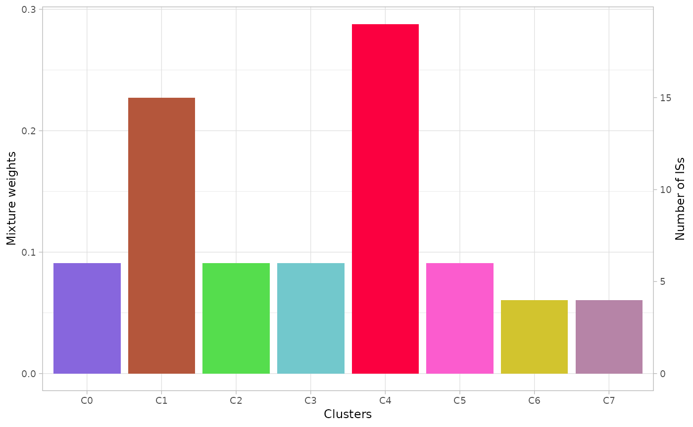

## Scatterplot

The function
[`plot_scatter_density()`](caravagnalab.github.io/lineaGT/reference/plot_scatter_density.md)
returns a list of 2D multivariate densities estimated by the model. The
argument `highlight` can be used to show only a subset of clusters and
the argument `min_frac` to show the clusters with the specified
frequency in at least one dimension.

Note that the observed coverage values across lineages and over time are
modeled as independent, therefore each dimension corresponds to a
combination of time-point and lineage.

``` r
plots = plot_scatter_density(x.example)
#> Warning: `aes_string()` was deprecated in ggplot2 3.0.0.
#> ℹ Please use tidy evaluation idioms with `aes()`.
#> ℹ See also `vignette("ggplot2-in-packages")` for more information.
#> ℹ The deprecated feature was likely used in the lineaGT package.
#>   Please report the issue to the authors.
#> This warning is displayed once per session.
#> Call `lifecycle::last_lifecycle_warnings()` to see where this warning was
#> generated.
plots$`cov.t2.l1:cov.t1.l2` # to visualize a single plot
```

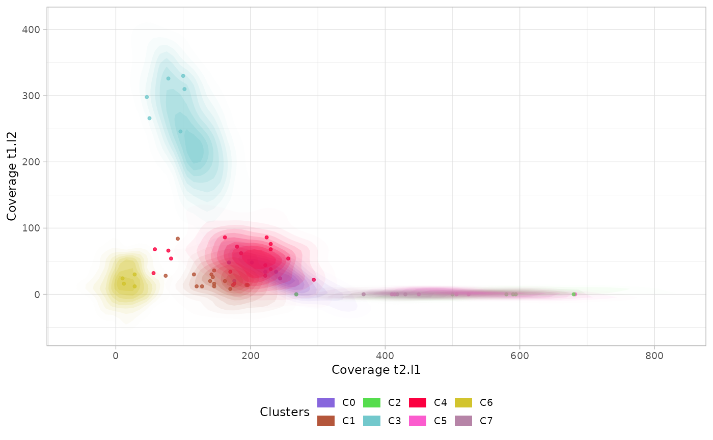

## Marginal distributions

The function
[`plot_marginal()`](caravagnalab.github.io/lineaGT/reference/plot_marginal.md)
returns a plot with the marginal estimated densities for each cluster,
time-point and lineage.

The option `single_plot` returns the density of the whole mixture
grouped by lineage and time-point.

``` r
marginals = plot_marginal(x.example)
marginals_mixture = plot_marginal(x.example, single_plot=T)
patchwork::wrap_plots(marginals / marginals_mixture)
```

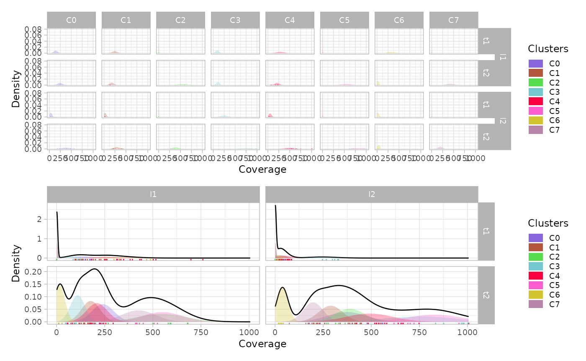

## Mullerplot

The function
[`plot_mullerplot()`](caravagnalab.github.io/lineaGT/reference/plot_mullerplot.md)
shows the expansion of the identified populations over time. It supports
the options `which=c("frac","pop")` corresponding to the absolule
population abundance and the relative fraction, respectively.

``` r
mp1 = plot_mullerplot(x.example, which="frac")
mp2 = plot_mullerplot(x.example, which="pop")
patchwork::wrap_plots(mp1, mp2, ncol=1)
```

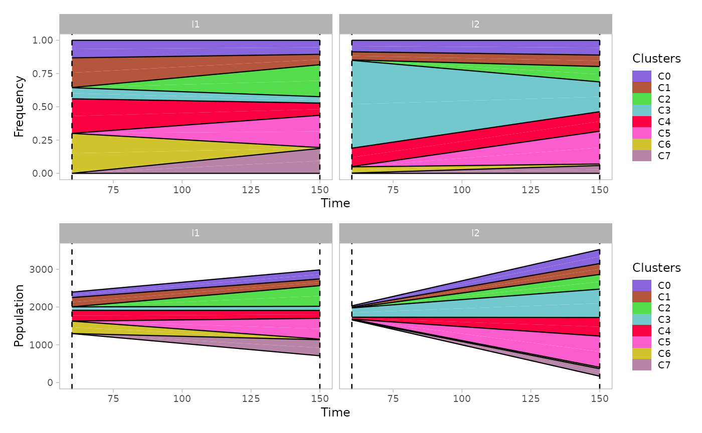

If the option `mutations` is set to `TRUE`, then the subclones
originated within each population will be reported as well in the
mullerplot.

``` r
mp1 = plot_mullerplot(x.example, which="frac", mutations=T)
mp2 = plot_mullerplot(x.example, which="pop", mutations=T)
patchwork::wrap_plots(mp1, mp2, ncol=1)
```

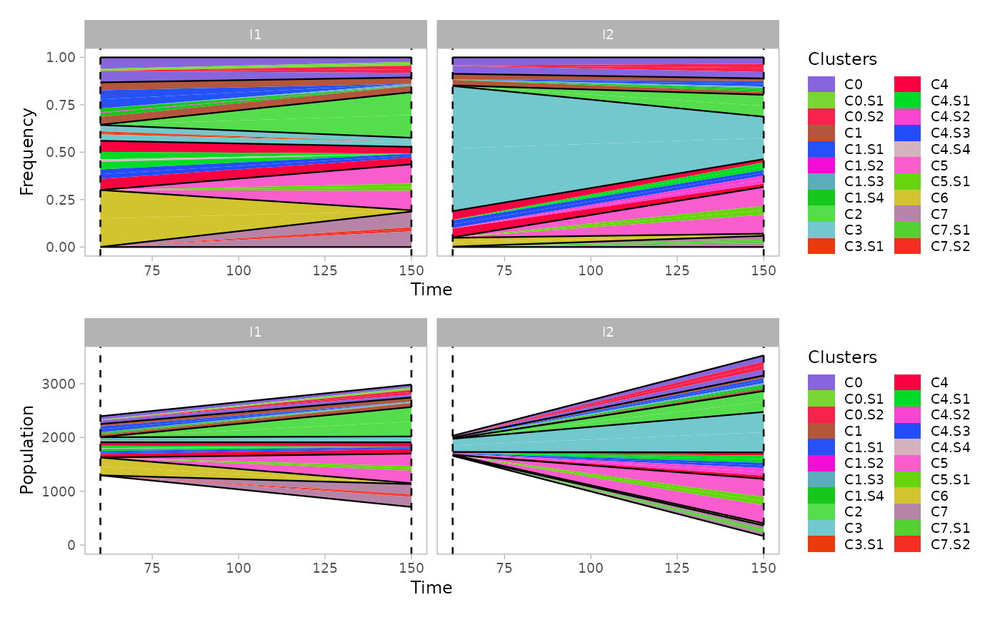

The function supports also the visualization of a single clone to
monitor the growth of subpopulations, through the argument
`single_clone`.

``` r
plot_mullerplot(x.example, highlight="C4", mutations=T, single_clone=T)
```

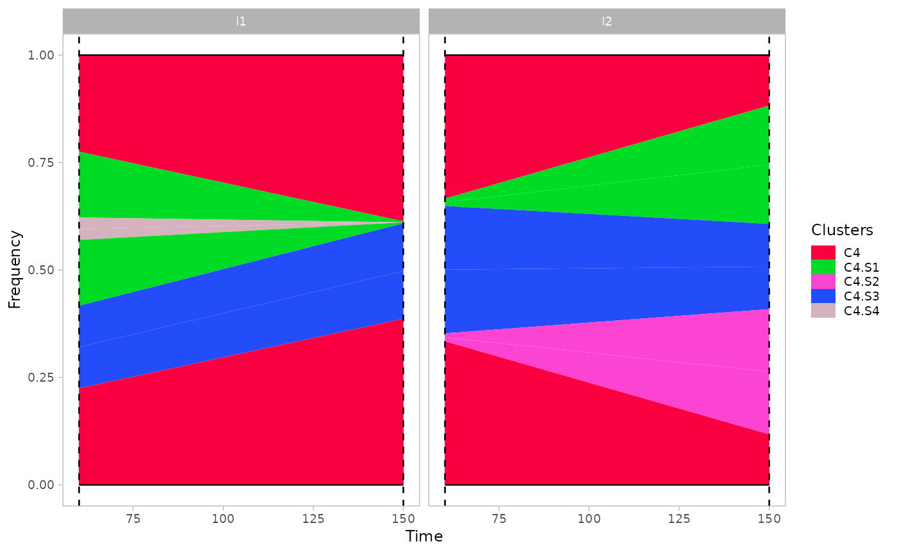

Moreover, some of the identified clusters (showing low coverage in all
dimensions) represents poly-clonal populations, since they cannot be
uniquely identified by the mixture model. Therefore, the estimated
abundance values might be readjusted according to the estimated number
of populations in each clusters.

``` r
estimate_n_pops(x.example)
#> C0 C1 C2 C3 C4 C5 C6 C7 
#>  1  2  1  1  2  1  1  1
```

``` r
plot_mullerplot(x.example, which="frac", mutations=T, estimate_npops=T)
```

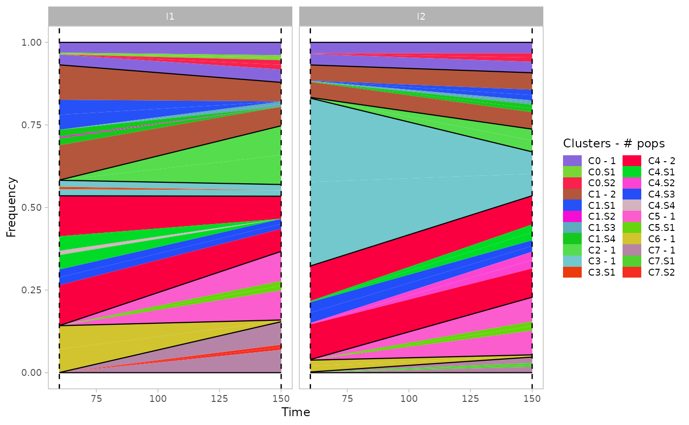

## VAF

The function
[`plot_vaf_time()`](caravagnalab.github.io/lineaGT/reference/plot_vaf_time.md)
can be used to visualize the behaviour of mutations variant allele
frequencies over time for each subclone.

``` r
plot_vaf_time(x.example)
#> Warning: Using `size` aesthetic for lines was deprecated in ggplot2 3.4.0.
#> ℹ Please use `linewidth` instead.
#> ℹ The deprecated feature was likely used in the lineaGT package.
#>   Please report the issue to the authors.
#> This warning is displayed once per session.
#> Call `lifecycle::last_lifecycle_warnings()` to see where this warning was
#> generated.
```

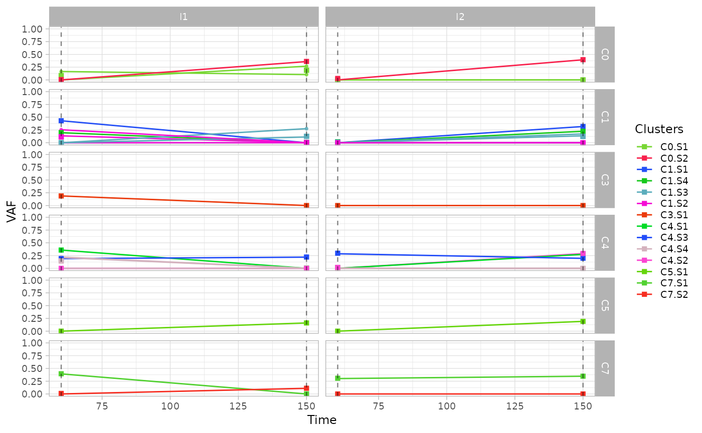

## Phylogenetic evolution

For each cluster of ISs, the function
[`plot_phylogeny()`](caravagnalab.github.io/lineaGT/reference/plot_phylogeny.md)
reports the estimated phylogenetic tree.

``` r
plot_phylogeny(x.example)
#> $C0
```

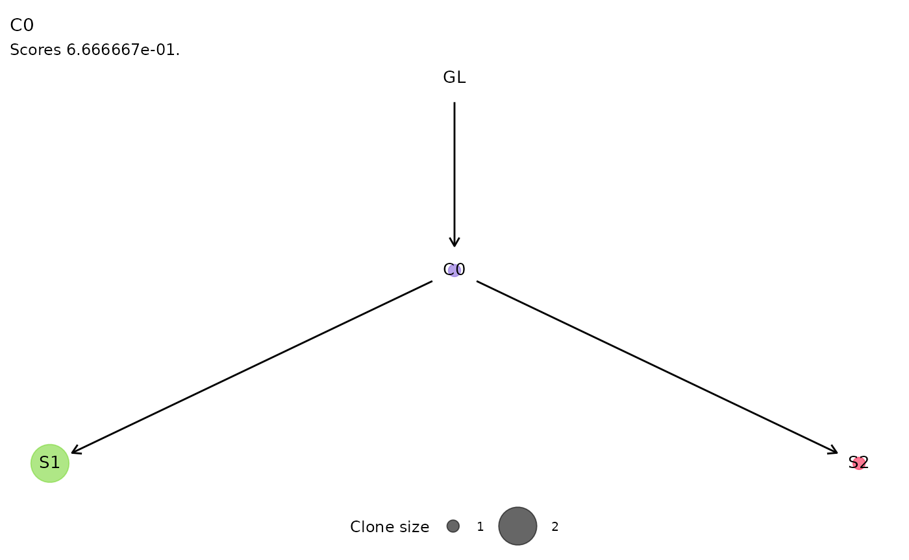

    #> 
    #> $C1

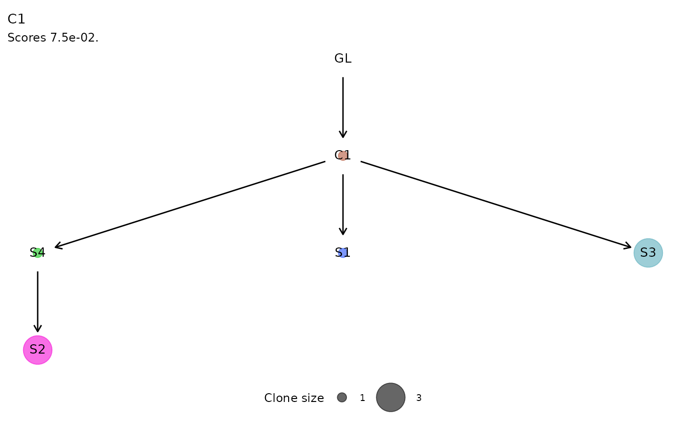

    #> 
    #> $C4

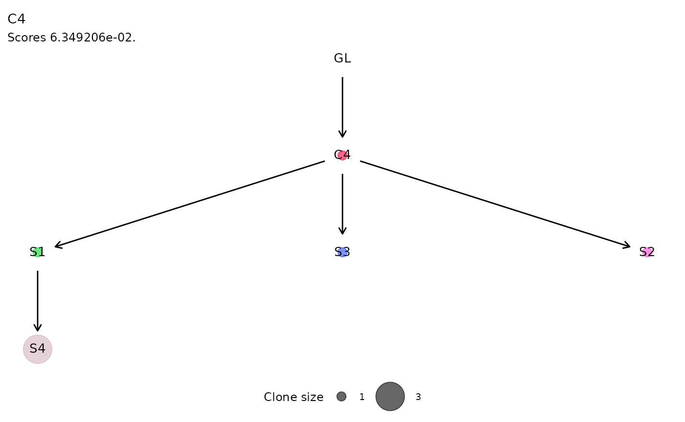

    #> 
    #> $C7

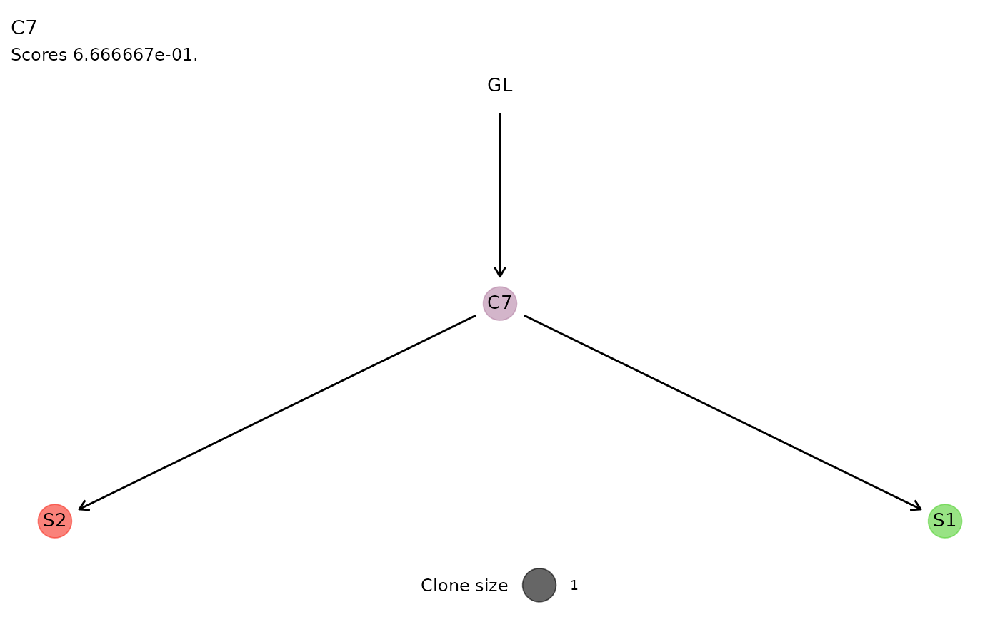

## Clonal Growth

The fitted exponential and logistic growth regressions are shown with
the
[`plot_growth_regression()`](caravagnalab.github.io/lineaGT/reference/plot_growth_regression.md)
, reporting by default the fit of the best model, selected as the one
with the highest likelihood.

Both regressions can be inspected setting `show_best=F` .

``` r
plot_growth_regression(x.example, show_best=F)
```

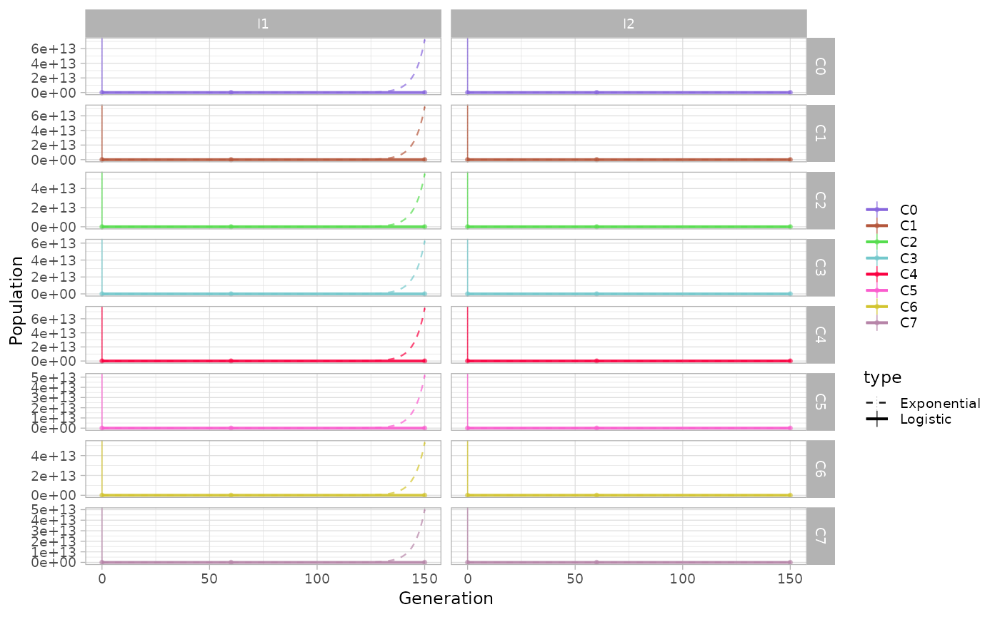

The same function can be used to show the growth regressions for the
subclones identified by somatic mutations.

``` r
plot_growth_regression(x.example, highlight="C4", mutations=T)
```

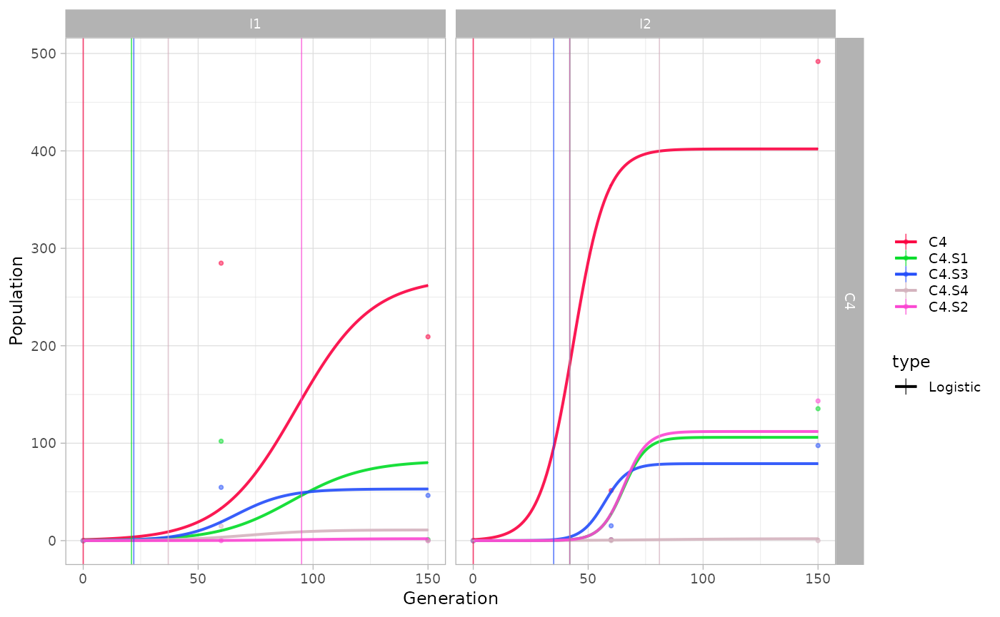

An alternative way of visualising differences in growth rates is through
[`plot_growth_rates()`](caravagnalab.github.io/lineaGT/reference/plot_growth_rates.md)
function, reporting the values of estimated growth rates for each
(sub)population.

Disabling the `show_best` option, the model with lowest likelihood is
shown as a dashed line.

``` r
plot_growth_rates(x.example, show_best=F)
```

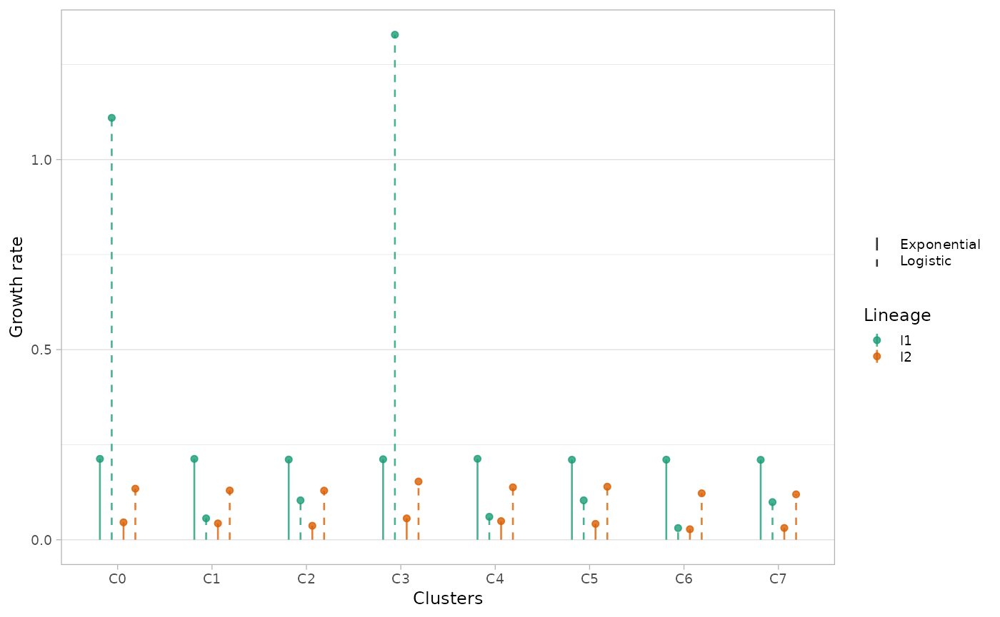
